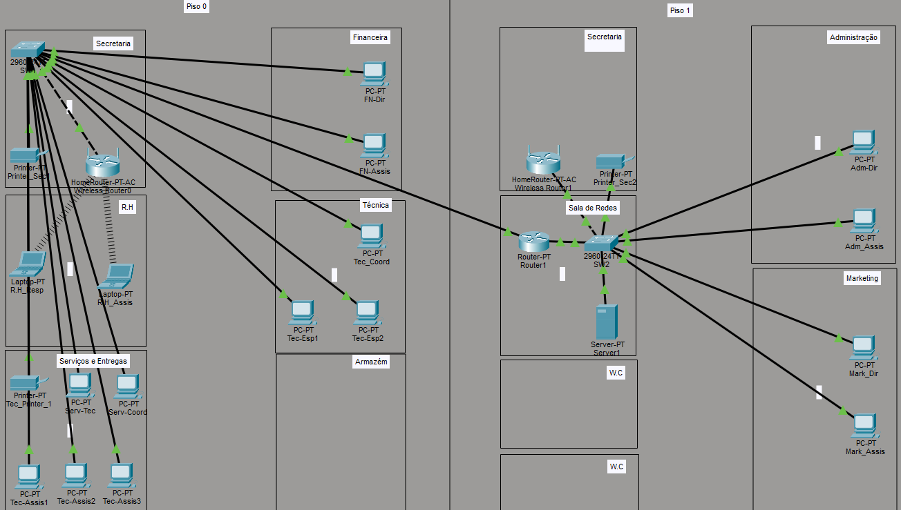

# Projeto de Infraestrutura e Cabeamento Estruturado

Este repositório apresenta o projeto de design e simulação de uma rede corporativa para uma empresa fictícia, desenvolvido no **Cisco Packet Tracer**. O projeto abrange desde o planejamento da planta física até a segmentação lógica da rede.

## 📍 Visão Geral
O projeto foi desenhado para atender 5 departamentos distintos, garantindo segurança, escalabilidade e organização através de sub-redes otimizadas.

## 🚀 Tecnologias e Conceitos Aplicados
- **Topologia:** Estrela Estendida.
- **Segmentação:** VLSM (Variable Length Subnet Masking) utilizando máscaras `/28`.
- **Hardware Simulado:** Roteadores Cisco, Switches 2960 e End-devices (PCs e Laptops).
- **Documentação:** Identificação visual de gateways e endereçamento na planta.

## 📊 Plano de Endereçamento (VLSM)
A rede foi segmentada para otimizar o uso de IPs e reduzir domínios de broadcast:

| Departamento | Rede | Gateway | Máscara |
| :--- | :--- | :--- | :--- |
| **Administração** | 192.168.10.0/28 | 192.168.10.254 | 255.255.255.240 |
| **Financeiro** | 192.168.20.0/28 | 192.168.20.254 | 255.255.255.240 |
| **Marketing** | 192.168.30.0/28 | 192.168.30.254 | 255.255.255.240 |
| **Secretaria** | 192.168.40.0/28 | 192.168.40.254 | 255.255.255.240 |

## 🖼️ Topologia do Projeto

---
*Projeto desenvolvido para fins de estudo e portfólio de infraestrutura de TI.*
